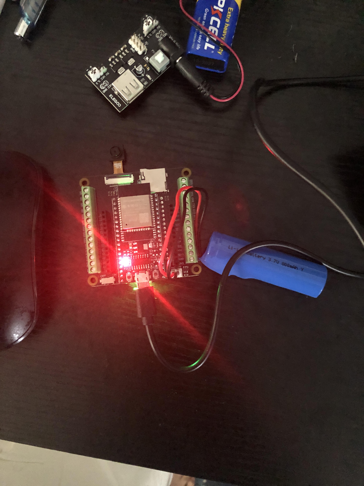
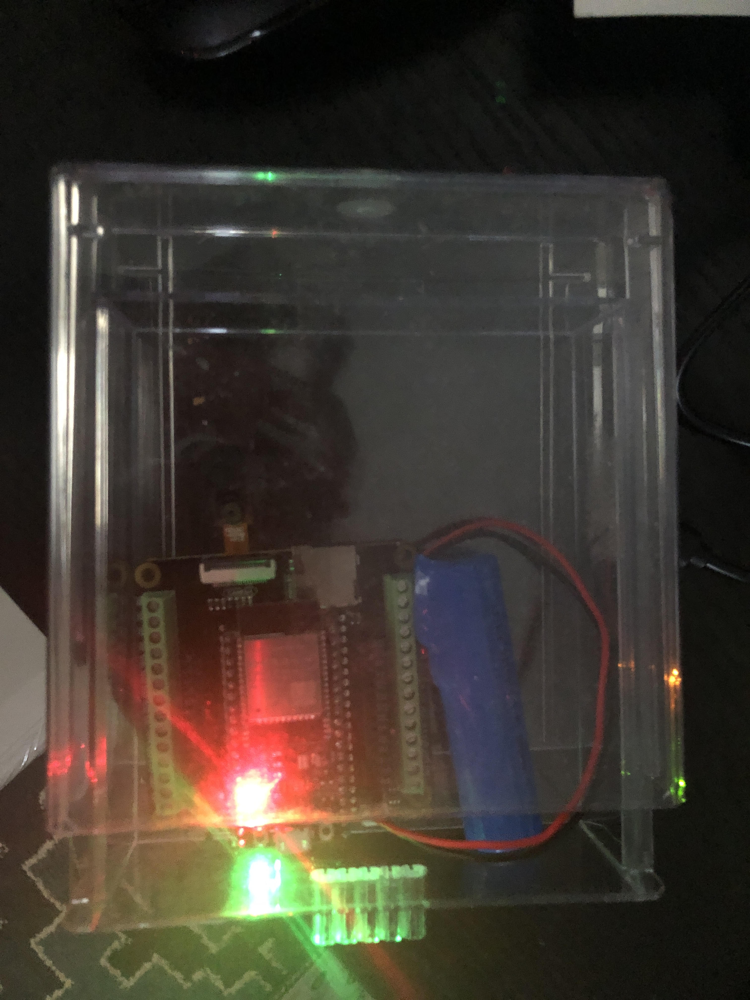

# ESP32-CAM Face Recognition Server

This project streams video from an ESP32-CAM, processes it on a computer to detect faces in real-time, and displays the result on a web browser.

## Demo Video

Watch a short demo of the project in action:

[](https://youtu.be/IKgGmIq1VX8)
*also at https://youtube.com/shorts/kTCV-fLhWL0
> Click the thumbnail above to watch the video.

## Project Images

images of setup here.

For example:




> images inside a folder called `images/` in  repository.

## Features

- **Live Stream**: View the ESP32-CAM feed in a browser.
- **Face Detection**: Real-time analysis of the video for faces.
- **Web Server**: Serves the processed video stream to your local network.
- **Console Logging**: Provides live feedback in the terminal, indicating when faces are detected.

## Prerequisites

### Hardware

- ESP32-CAM module
- Power supply for ESP32-CAM

### Software

Install the following Python libraries using pip. It is highly recommended to install them in the following order to resolve potential dependency issues:

```bash
pip install flask
pip install opencv-python
pip install numpy
pip install dlib
pip install face-recognition
pip install mss
```

**Note**: The `dlib` library may take a while to install as it compiles from source.

## Usage

1. Flash your ESP32-CAM and open its video stream in a web browser on your computer.
2. Ensure the browser window with the stream is visible.
3. Run the Python script from your terminal:

```bash
python esp32_face_recognition.py
```

4. Open a browser and navigate to the IP address shown in your terminal to view the processed stream.

## Troubleshooting

- **Freezing**: If the terminal output freezes, it may be due to slow processing.
- **Stream Won't Load**: Check your firewall settings to ensure that TCP traffic on port 5000 is allowed.
- **Stopping the Server**: Press `CTRL + C` in the terminal to stop the program.
